# Carl Jabido

I build software for my own home and habits: a speaker that remembers what it played, the bus I'm trying to catch, a family tree, a Steam Deck that runs local models. Most of it runs on a Mac server at home and a small VPS, shipped by deploy tooling I also wrote.

[carljabido.dev](https://carljabido.dev)

## Sonos Dashboard

**Everything my Sonos speaker plays, logged, charted and shown on an e-paper screen.**

Sonos doesn't keep a listening history, so this backend keeps one. It polls the speaker over its local UPnP/SOAP API every few seconds, records each new track to MongoDB with cached album art, and serves a web dashboard with live now-playing, weekly and all-time charts, favorites and alarm management. The same server renders 1-bit frames for a reTerminal e-paper panel: a now-playing screen while music plays, and a clock with the next alarm and today's listening when it doesn't. The night before an office day, the clock shrinks to make room for tomorrow's forecast.

Web · E-paper · Home server · private repo · Node.js, Express, MongoDB, node-canvas, UPnP/SOAP, Docker, Open-Meteo

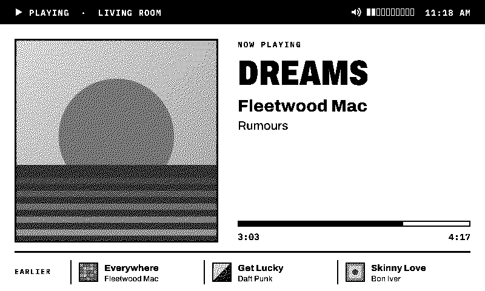

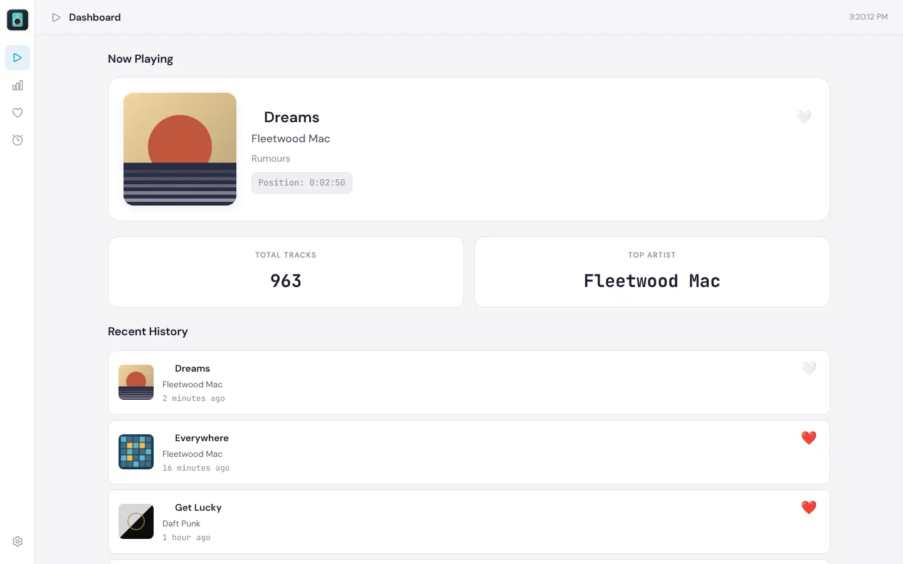

## YTArchive

**My YouTube watch history, searchable, taggable and resumable.**

YTArchive imports Google Takeout exports into SQLite and puts a fast React interface on top: search, tags, a watchlist, stats and an edge-to-edge wall of thumbnails. A Safari extension syncs watch progress from YouTube's history page every six hours, so the Continue Watching list covers my phone, TV and laptop without running anything on them. It also tracks Crunchyroll anime history, can send a video to the Apple TV, and has an MCP server so Claude agents can search and tag the archive.

Web · Safari extension · MCP · private repo · Python, FastAPI, SQLite FTS5, React, Vite, Tailwind, TanStack Query, MCP

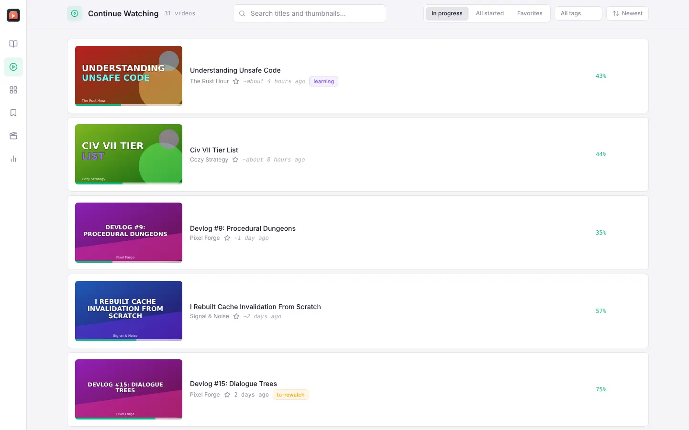

## Kinship

**A private family tree that several families maintain together.**

Kinship is a shared workspace where related families browse and maintain one family tree. The tree is drawn from parent and partner relationships and grouped by generation, and someone who married in appears in both families' views. A path finder traces how any two people are related. Admins invite relatives as viewers, contributors or family admins, and every change goes into a searchable history.

Web · VPS · private repo · Next.js, React 19, TypeScript, SQLite, Drizzle, Better Auth, Tailwind, Docker

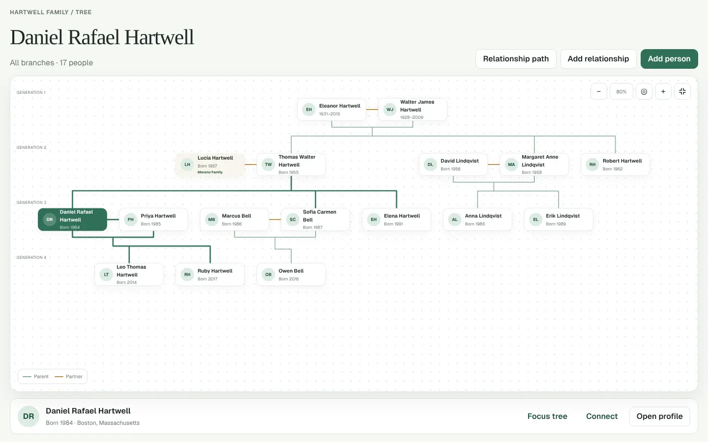

## Tessier-Ashpool Cyberdeck

**A Neuromancer-themed console for running local AI on a Steam Deck.**

The Cyberdeck replaces the Steam Deck's home screen with a gamepad-driven console that launches local AI apps: WINTERMUTE, an LLM on llama.cpp; ONO-SYNTH, voice cloning with Chatterbox; and SIMSTIM, mic capture and speech-to-text with Qwen3-ASR. They work together. Hold a rear grip in WINTERMUTE and speak, and SIMSTIM's transcript lands in the chat box. Every app ships a stub engine, so the whole console runs before you download any model weights. These screenshots show it in that state, and the panels say so.

Steam Deck · SteamOS · private repo · Python, FastAPI, Web Components, llama.cpp, Chatterbox, Qwen3-ASR, systemd

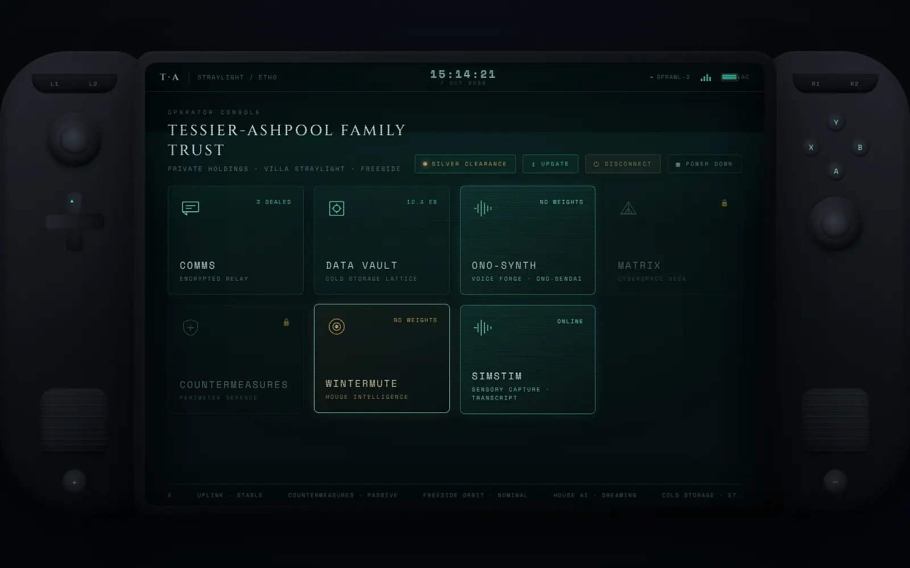

## Bus Tracker

**Is the 156R ever on time? Scheduled versus actual arrivals at one stop.**

Every weekday morning a Selenium scraper saves NJ Transit's posted arrival times for my stop into PostgreSQL with TimescaleDB. On my phone, an offline-first web app records when each bus actually shows up, keeps those records in IndexedDB while I'm at the stop, and syncs them once I'm back on home Wi-Fi. The server matches each actual arrival to its scheduled one, so over time the data shows how late the route really runs.

Phone web app · Home server · private repo · Python, FastAPI, Selenium, PostgreSQL, TimescaleDB, IndexedDB, Service worker

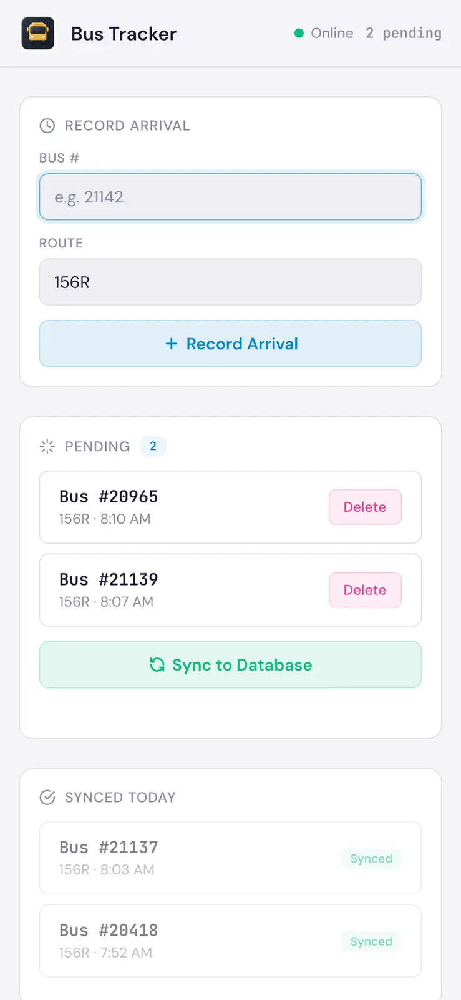 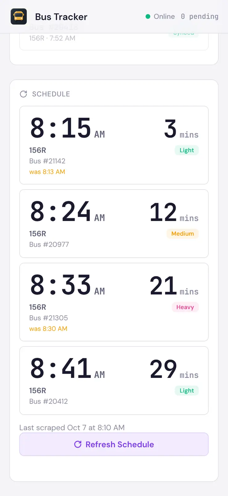 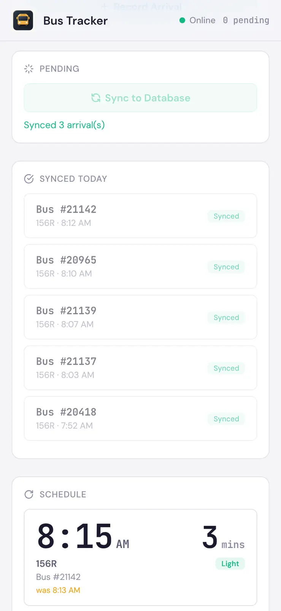

## Personal Podcasts

**A private podcast feed for videos I'd rather listen to.**

A small self-hosted RSS server that publishes an Apple Podcasts-compatible feed over Tailscale HTTPS. A companion CLI downloads episodes from YouTube or Patreon with yt-dlp and uploads them, and a daily scan picks up new episodes from the channels I follow. The web admin edits feed and episode details and can start a scan on demand.

Web admin · RSS · Home server · private repo · Python, FastAPI, SQLite, feedgen, yt-dlp, nginx, Tailscale, launchd

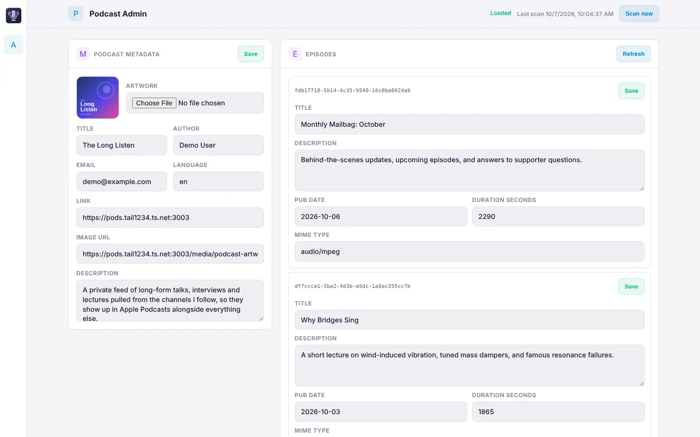

## App Registry

**Where everything in the homelab lives, for me and for my AI agents.**

A catalogue of every app I run: LAN, public and Tailscale hostnames, ports, admin pages and the last deployed commit. I maintain it from an installable web page. Claude agents query it over an MCP endpoint to find out how to reach a service, and the deploy tool records every deploy back into it.

Web · MCP · Home server · private repo · Node.js, Express, SQLite, MCP SDK, zod, PWA

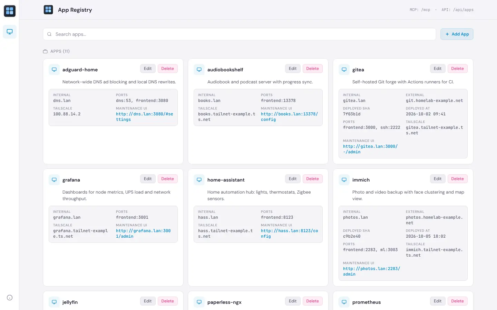

## Trading Terminal

**A Bloomberg-style terminal for news sentiment, analyst calls and market regimes.**

This started as component tests for a trading-signal system and grew into a toolkit. It pulls news sentiment, analyst ratings, sector rotation and prices from free-tier APIs, detects bull, sideways and bear regimes with a hidden Markov model, and shows it all in a Textual terminal app. A scheduled prefetch job fills a SQLite store, so the terminal opens instantly. Order handling is tested against Alpaca's paper-trading API.

Terminal · Python · private repo · Python, Textual, Rich, hmmlearn, pandas, SQLite, pytest

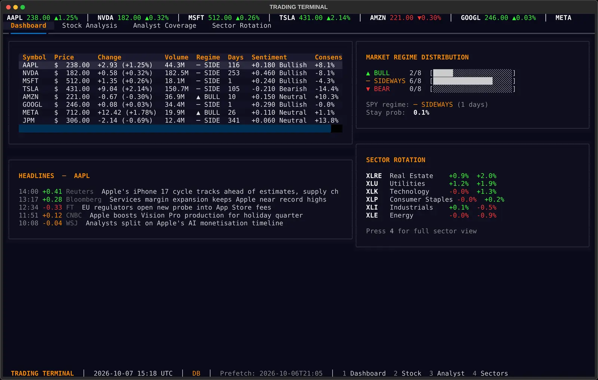

## Also on the bench

**Covered** · iPhone · iPad · Mac  
A private bills-and-cash app built around one question: do I have enough cash for the bills coming due? You keep a few balances and dates up to date, and Covered turns them into a short-term forecast that names the date and size of any shortfall. No bank connections and no budgeting. It syncs through iCloud, and bills, income and accounts work with Shortcuts, Spotlight and Siri without amounts ever leaving the app.

**[qwen3-tts](https://github.com/cjabido/qwen3-tts)** · macOS · Apple Silicon  
Command-line text-to-speech and voice cloning that runs entirely on a Mac, using Qwen3-TTS on MLX. Describe a voice in words, or clone one from a short clip. An interactive mode records a sample, checks its quality, transcribes it with Qwen3-ASR, then queues and plays phrases as fast as they generate.

**ops** · CLI · GitHub Actions  
The deploy engine behind everything above. deployctl copies a Python engine to the host and runs it there: take a lock, validate, snapshot, apply, health-check, and roll back automatically if the check fails. VPS apps run prebuilt images pinned by digest and ship from a GitHub Actions workflow over Tailscale. Every exit code means exactly one thing.

Screenshots were taken from each app built from source and run with invented demo data.
